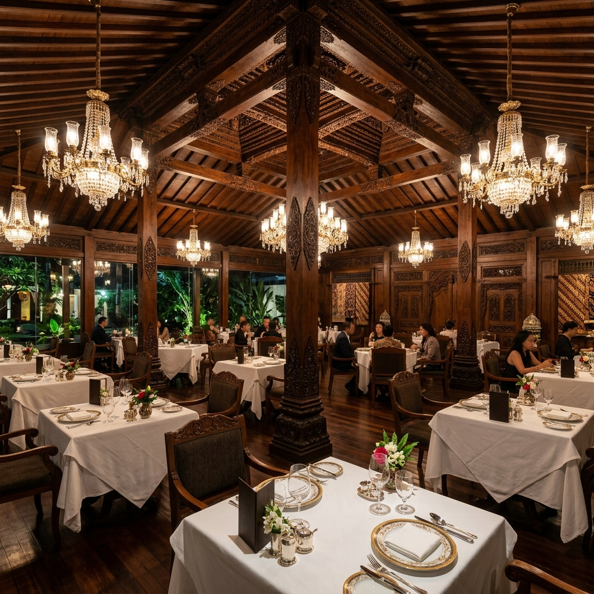

## PLATARAN DINING & ESTATE - Web Reservation System



## DESKRIPSI PROYEK
Proyek ini adalah sistem reservasi meja restoran berbasis web yang dirancang untuk **Plataran Dharmawangsa**. Aplikasi ini dibangun untuk mengubah sistem pencatatan pemesanan meja yang sebelumnya manual menjadi sistem digital yang efisien, aman, dan elegan.Proyek ini adalah sistem reservasi meja restoran berbasis web yang dirancang untuk **Plataran Dharmawangsa**. Aplikasi ini dibangun untuk mengubah sistem pencatatan pemesanan meja yang sebelumnya manual menjadi sistem digital yang efisien, aman, dan elegan.

Proyek ini dikembangkan sebagai pemenuhan tugas **Final Project (Asesmen II) Mata Kuliah Pemrograman Web** di Universitas Ary Ginanjar (UAG). Sistem ini menerapkan arsitektur *Dynamic Page* dan konsep *Object-Oriented Programming (OOP)* murni menggunakan PHP Native.

## FITUR UTAMA
Sistem ini telah memenuhi standar minimal 3 fitur utama dan 2 peran pengguna (User & Admin):

1. **Sistem Dynamic Page & Routing:** Navigasi aplikasi dikelola secara terpusat melalui `index.php` menggunakan metode Query String (`$_GET['p']`), memungkinkan pergantian halaman yang mulus tanpa perlu membuat banyak file HTML statis yang berulang.
2. **Form Reservasi Pelanggan (User):** Antarmuka bagi pelanggan untuk memesan meja dengan memilih tanggal, nomor meja, dan preferensi area (*Smoker/Non-Smoker*). Dilengkapi dengan validasi *front-end* (HTML5 Required) dan *back-end* (PHP Exception).
3. **Dashboard Manajemen Meja (Admin):**
   Tampilan khusus untuk pengelola restoran yang menampilkan daftar riwayat meja yang telah ter-reservasi pada sesi tersebut.
4. **Validasi Data Berlapis (Exception Handling):**
   Sistem menolak input *spam* dengan memvalidasi:
   - Nama pelanggan (minimal 3 karakter, hanya huruf).
   - Ekstensi domain email (hanya menerima domain resmi seperti Gmail, Yahoo, dan email kampus).
   - Validasi tahun pemesanan (hanya mengizinkan pemesanan di tahun berjalan).

## 🛠️ Teknologi & Konsep yang Digunakan
- **Bahasa Pemrograman:** PHP 8+, HTML5, CSS3.
- **Arsitektur:** Dynamic Page Representation.
- **OOP (Object-Oriented Programming):**
  - **Encapsulation:** Melindungi data sensitif pemesan menggunakan *visibility* `private` beserta *Getter & Setter*.
  - **Magic Methods:** Penggunaan `__construct()` untuk inisialisasi objek dan `__toString()` untuk mencetak ringkasan reservasi.
- **Autoloading:** Menggunakan `spl_autoload_register` untuk memuat *class* secara dinamis tanpa perlu deklarasi `require` berulang kali.
- **Manajemen State:** Menggunakan `$_SESSION` untuk menyimpan riwayat reservasi sementara tanpa *database*.

## 📂 Struktur Direktori
Repository ini disusun dengan prinsip pemisahan logika (*Separation of Concerns*) agar kode tetap *clean* dan mudah di-*maintain*.

```text
📦 plataran-reservation
 ┣ 📂 class
 ┃ ┗ 📜 class.Reservasi.php      # Blueprint OOP untuk objek reservasi
 ┣ 📂 pages
 ┃ ┗ 📜 form_reservasi.php       # Tampilan form input untuk pelanggan
 ┣ 📜 index.php                  # File utama (Router & Controller)
 ┣ 📜 header.php                 # Komponen layout atas (Navigasi & CSS)
 ┣ 📜 footer.php                 # Komponen layout bawah (Copyright)
 ┣ 📜 logo-white.png             # Asset gambar
 ┣ 📜 logo-brown.jpg             # Asset gambar
 ┗ 📜 hero_bg.png                # Asset gambar
```

## CARA MENJALANKAN APLIKASI ##

1. Pastikan Anda telah menginstal local server environment seperti XAMPP.
2. Clone repository ini ke dalam direktori htdocs Anda:
   git clone [https://github.com/username-anda/plataran-reservation.git](https://github.com/username-anda/plataran-reservation.git)
3. Nyalakan modul Apache pada XAMPP Control Panel.
4. Buka browser dan akses alamat berikut:
   http://localhost/plataran-reservation/index.php


## TIM PENGEMBANG 
- Muhammad Irsyad Hanafi - Project Lead/ Fullstack Developer
- Muhammad Fathi Nurulhaq - Frontend Specialist
- Muhammad Adrian Luthfi - QA & Tester
- Danish Faiz Ali - Content & Document Control
